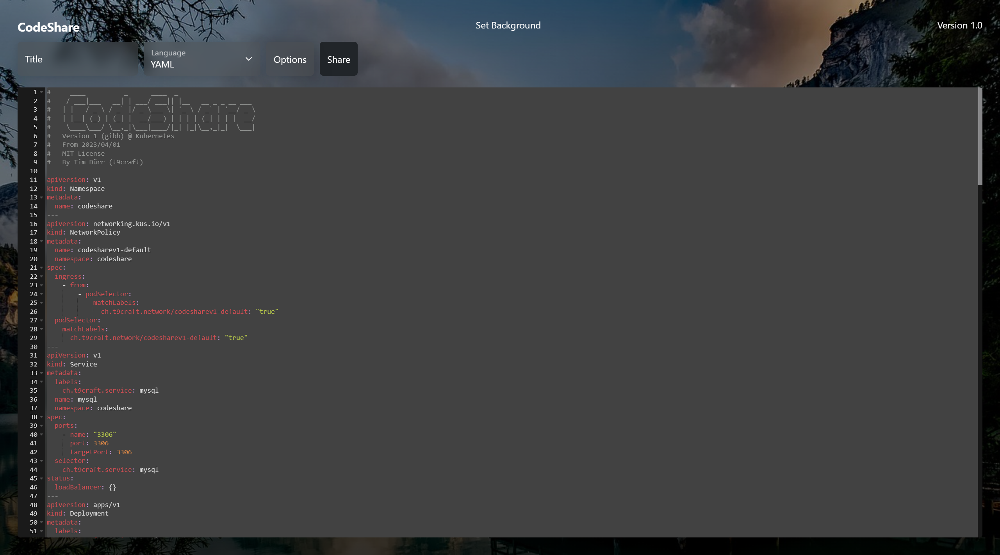
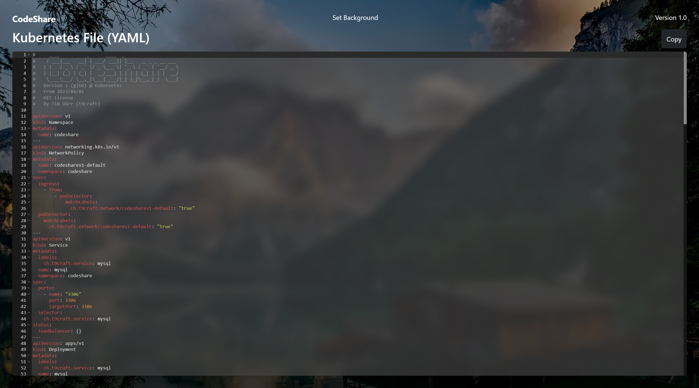

<h1 align="center">
  <br>
  CodeShare
  <br>
</h1>

<h4 align="center">A Docker / Kubernetes Web App that helps you share code with your colleagues really fast. ⚡</h4>

<p align="center">
  
  
</p>

<p align="center">
  <a href="#docker">Docker</a> •
  <a href="#kubernetes">Kubernetes</a>
</p>

<table>
  <thead>
    <tr>
      <th>Title Screen</th>
      <th>Editor</th>
      <th>Viewer (shared)</th>
    </tr>
  </thead>
  <tbody>
    <tr>
      <td></td>
      <td></td>
      <td></td>
    </tr>
  </tbody>
</table>

# Deployment
## Docker
### Prerequisites
Before you start, you'll need to make sure you have the following installed:
- Docker
- Docker Compose

### Step 1: Clone the Repository
First, clone the CodeShare repository from GitHub:
```git clone https://github.com/TD99/code-share.git```  

### Step 2: Navigate to the Repo-Directory (cd)

### Step 3: Start the Application
To start the CodeShare application, run the following command:
```docker-compose up -d```  
This will start the application in detached mode, which means it will continue to run in the background even after you close the terminal.

### Step 4: Access the Application
Once the application is running, you can access it in your web browser at [http://localhost:80](http://localhost:80).

### Step 5 (optional): Change the Config File
For production, it's important to change the Usernames and Passwords for the DB. Change them in `docker-compose.yaml` (both MySQL and PHP environment).

## Kubernetes
### Prerequisites
- Kubernetes (microk8s)
- Ingress

### Step 1: Clone the Repository
First, clone the CodeShare repository from GitHub:
```git clone https://github.com/TD99/code-share.git```  

### Step 2: Navigate to the Repo-Directory (cd)

### Step 3: Deploy the Application
To deploy the CodeShare application, run the following command:
```sudo microk8s kubectl apply -f ./kubernetes.yaml```  

### Step 4: Access the Application
Once the application is deployed, you can access it in your web browser by using the ClusterIP address of the Nginx service. To find the IP address, run the following command:
```sudo microk8s kubectl get services -n codeshare```  
This will display the IP address (column: CLUSTERIP) of the Nginx service. You can then access the application in your web browser by using the IP address.

#### Ingress
Ingress is not working properly with Nginx at the moment. It is currently resulting HTTP 504 Errors. I will be working on this in the future.

**If you still want to use Ingress**
Edit the "Hosts" file (on Linux: `/etc/hosts`) and add the following lines:
```
...
127.0.0.1    codeshare.local
...
```
The CodeShare-Website should now be reachable at [http://codeshare.local:80](http://codeshare.local:80).

### Step 5 (optional): Change the Config File
For production, it's important to change the Usernames and Passwords for the DB. Change them in `kubernetes.yaml` (both MySQL and PHP environment). You can also change the number or replicas. The fields are marked with comments.

### Delete CodeShare
The following command will delete the `codeshare` namespace and all the resources associated with it:
```sudo microk8s kubectl delete namespace codeshare```  
